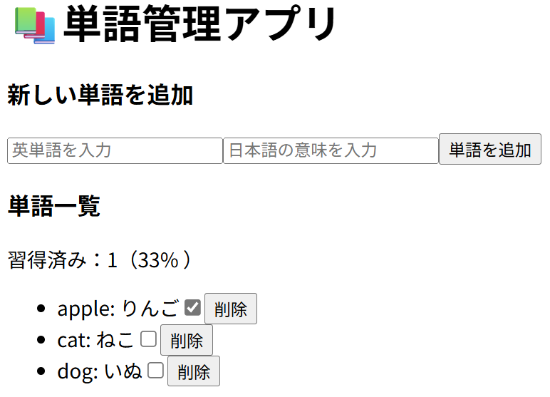

# simple-word-manager

## 概要
このプロジェクトは、React を使って構築したシンプルな単語管理アプリです。

React の状態管理やコンポーネント設計を学ぶことを目的に制作しました。

## デモ

## 主な機能
- 単語の追加・削除
- 単語の一覧表示
- 習得状態の切り替え

## 使用技術
- **フロントエンド**  
  - React
  - Vite